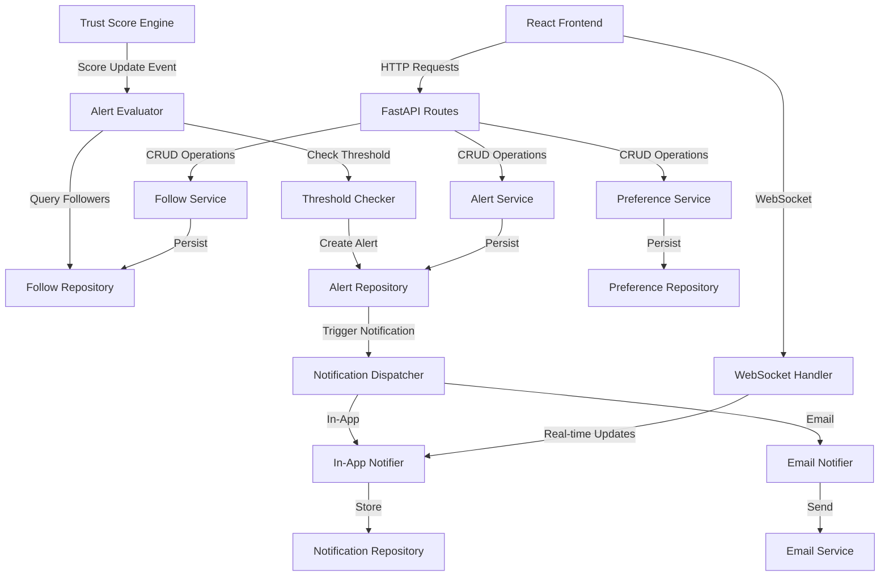
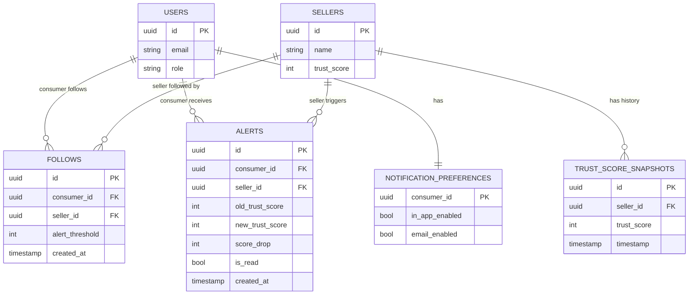

# Design Document: Seller Alert System

## Overview

The Seller Alert System is a real-time notification feature that enables Trustora consumers to monitor sellers and receive alerts when trust scores drop significantly. The system integrates with the existing FastAPI backend, React/TypeScript frontend, and trust score computation engine.

The design follows a layered architecture with clear separation between data persistence, business logic, notification delivery, and presentation layers. The system uses event-driven architecture to detect trust score changes and trigger alerts in real-time.

### Key Design Principles

1. **Event-Driven Architecture**: Trust score updates trigger events that flow through the alert evaluation pipeline
2. **Asynchronous Processing**: Alert generation and notification delivery happen asynchronously to avoid blocking trust score updates
3. **Scalability**: Design supports thousands of follow relationships and concurrent alert processing
4. **Extensibility**: Notification channels (in-app, email) are pluggable for future expansion
5. **Data Integrity**: All operations maintain consistency between follow relationships, alerts, and user preferences

## Architecture

### System Components



### Data Flow

1. **Trust Score Update Flow**:
   - Trust Score Engine computes new score
   - Score update event published to Alert Evaluator
   - Alert Evaluator queries Follow Repository for affected consumers
   - Threshold Checker compares score drop against thresholds
   - Alerts created and persisted via Alert Repository
   - Notification Dispatcher sends notifications based on preferences

2. **Follow Management Flow**:
   - Consumer requests to follow seller via API
   - Follow Service validates seller exists
   - Follow Repository creates follow relationship with default threshold
   - Success response returned to frontend

3. **Alert Retrieval Flow**:
   - Consumer requests alerts via API
   - Alert Service queries Alert Repository
   - Alerts formatted and returned with pagination
   - Frontend displays alerts in notification panel

## Components and Interfaces

### Backend Components

#### 1. Data Models (Pydantic/SQLAlchemy)

**FollowRelationship Model**
```python
class FollowRelationship(BaseModel):
    id: UUID
    consumer_id: UUID
    seller_id: UUID
    alert_threshold: int  # Points (1-100)
    created_at: datetime
    updated_at: datetime
```

**Alert Model**
```python
class Alert(BaseModel):
    id: UUID
    consumer_id: UUID
    seller_id: UUID
    seller_name: str
    old_trust_score: int
    new_trust_score: int
    score_drop: int
    threshold_triggered: int
    created_at: datetime
    is_read: bool
    delivered_in_app: bool
    delivered_email: bool
```

**NotificationPreferences Model**
```python
class NotificationPreferences(BaseModel):
    consumer_id: UUID
    in_app_enabled: bool
    email_enabled: bool
    updated_at: datetime
```

**TrustScoreSnapshot Model**
```python
class TrustScoreSnapshot(BaseModel):
    seller_id: UUID
    trust_score: int
    timestamp: datetime
```

#### 2. Repository Layer

**FollowRepository**
- `create_follow(consumer_id, seller_id, threshold) -> FollowRelationship`
- `delete_follow(consumer_id, seller_id) -> bool`
- `get_follows_by_consumer(consumer_id) -> List[FollowRelationship]`
- `get_followers_by_seller(seller_id) -> List[FollowRelationship]`
- `update_threshold(consumer_id, seller_id, threshold) -> FollowRelationship`
- `follow_exists(consumer_id, seller_id) -> bool`

**AlertRepository**
- `create_alert(alert_data) -> Alert`
- `get_alerts_by_consumer(consumer_id, limit, offset) -> List[Alert]`
- `get_alert_history(consumer_id, filters) -> List[Alert]`
- `mark_as_read(alert_id) -> Alert`
- `get_unread_count(consumer_id) -> int`
- `batch_create_alerts(alerts) -> List[Alert]`

**PreferenceRepository**
- `get_preferences(consumer_id) -> NotificationPreferences`
- `update_preferences(consumer_id, preferences) -> NotificationPreferences`
- `create_default_preferences(consumer_id) -> NotificationPreferences`

**SnapshotRepository**
- `get_latest_snapshot(seller_id) -> Optional[TrustScoreSnapshot]`
- `save_snapshot(seller_id, trust_score) -> TrustScoreSnapshot`
- `get_snapshot_history(seller_id, limit) -> List[TrustScoreSnapshot]`

#### 3. Service Layer

**FollowService**
- `follow_seller(consumer_id, seller_id, threshold) -> FollowRelationship`
  - Validates seller exists
  - Checks for duplicate follows
  - Creates follow relationship with threshold
  - Returns created relationship
  
- `unfollow_seller(consumer_id, seller_id) -> bool`
  - Removes follow relationship
  - Returns success status
  
- `get_followed_sellers(consumer_id) -> List[SellerWithThreshold]`
  - Retrieves all followed sellers with current trust scores
  - Includes threshold settings
  
- `update_alert_threshold(consumer_id, seller_id, threshold) -> FollowRelationship`
  - Validates threshold range (1-100)
  - Updates threshold for follow relationship

**AlertService**
- `get_alerts(consumer_id, limit, offset) -> PaginatedAlerts`
  - Retrieves alerts with pagination
  - Includes unread count
  
- `get_alert_history(consumer_id, filters) -> List[Alert]`
  - Supports date range filtering
  - Supports seller filtering
  
- `mark_alert_read(consumer_id, alert_id) -> Alert`
  - Validates alert belongs to consumer
  - Updates read status
  
- `mark_all_read(consumer_id) -> int`
  - Marks all alerts as read
  - Returns count of updated alerts

**PreferenceService**
- `get_preferences(consumer_id) -> NotificationPreferences`
  - Returns current preferences
  - Creates defaults if not exist
  
- `update_preferences(consumer_id, preferences) -> NotificationPreferences`
  - Validates preference values
  - Updates and returns preferences

**AlertEvaluationService**
- `evaluate_trust_score_update(seller_id, new_score) -> List[Alert]`
  - Retrieves previous score from snapshot
  - Calculates score change
  - Queries followers with thresholds
  - Creates alerts for threshold breaches
  - Saves new snapshot
  - Returns created alerts
  
- `process_alert_batch(alerts) -> None`
  - Groups alerts by consumer
  - Applies batching rules (5-minute window)
  - Dispatches to notification system

**NotificationService**
- `dispatch_alert(alert, preferences) -> NotificationResult`
  - Checks notification preferences
  - Sends in-app notification if enabled
  - Sends email notification if enabled
  - Returns delivery status
  
- `send_in_app_notification(consumer_id, alert) -> bool`
  - Stores notification in repository
  - Triggers WebSocket push if consumer online
  - Returns success status
  
- `send_email_notification(consumer_id, alert) -> bool`
  - Formats email content
  - Sends via email service
  - Logs delivery status
  - Returns success status
  
- `batch_notifications(consumer_id, alerts) -> Notification`
  - Combines multiple alerts into single notification
  - Formats summary message
  - Returns batched notification

#### 4. API Routes

**Follow Management Routes**
```python
POST   /api/alerts/follow
  Body: { seller_id: UUID, threshold?: int }
  Response: FollowRelationship
  
DELETE /api/alerts/follow/{seller_id}
  Response: { success: bool }
  
GET    /api/alerts/following
  Query: ?limit=50&offset=0
  Response: { follows: List[FollowWithSeller], total: int }
  
PUT    /api/alerts/threshold/{seller_id}
  Body: { threshold: int }
  Response: FollowRelationship
```

**Alert Routes**
```python
GET    /api/alerts
  Query: ?limit=20&offset=0&unread_only=false
  Response: { alerts: List[Alert], unread_count: int, total: int }
  
GET    /api/alerts/history
  Query: ?seller_id=UUID&start_date=ISO&end_date=ISO&limit=50
  Response: { alerts: List[Alert], total: int }
  
PUT    /api/alerts/{alert_id}/read
  Response: Alert
  
PUT    /api/alerts/read-all
  Response: { updated_count: int }
```

**Preference Routes**
```python
GET    /api/alerts/preferences
  Response: NotificationPreferences
  
PUT    /api/alerts/preferences
  Body: { in_app_enabled: bool, email_enabled: bool }
  Response: NotificationPreferences
```

#### 5. Event Handling

**TrustScoreUpdateHandler**
- Listens for trust score update events
- Triggers `AlertEvaluationService.evaluate_trust_score_update()`
- Handles errors and retries
- Logs processing metrics

**Implementation Options**:
1. **Polling Approach** (Simple, for MVP):
   - Periodic job checks for trust score changes
   - Compares against snapshots
   - Suitable for initial implementation

2. **Event-Driven Approach** (Scalable):
   - Trust Score Engine publishes events to message queue
   - Alert system subscribes to events
   - Asynchronous processing
   - Better for production scale

### Frontend Components

#### 1. React Components

**FollowButton Component**
```typescript
interface FollowButtonProps {
  sellerId: string;
  isFollowing: boolean;
  onFollowChange: (following: boolean) => void;
}

// Displays follow/unfollow button on seller profile
// Handles follow/unfollow actions
// Shows loading state during API calls
```

**NotificationBadge Component**
```typescript
interface NotificationBadgeProps {
  unreadCount: number;
  onClick: () => void;
}

// Displays notification icon with unread count
// Positioned in main navigation
// Triggers notification panel on click
```

**NotificationPanel Component**
```typescript
interface NotificationPanelProps {
  isOpen: boolean;
  onClose: () => void;
}

// Displays list of alerts
// Supports mark as read
// Links to seller profiles
// Shows empty state when no alerts
// Includes "View All" link to history page
```

**AlertHistoryPage Component**
```typescript
// Full-page view of alert history
// Supports filtering by date range and seller
// Pagination for large alert lists
// Export functionality (future enhancement)
```

**NotificationPreferencesPage Component**
```typescript
// Settings page for notification preferences
// Toggle switches for in-app and email notifications
// Threshold management for followed sellers
// Save/cancel actions
```

**NotificationToast Component**
```typescript
interface NotificationToastProps {
  alert: Alert;
  onDismiss: () => void;
}

// Real-time toast notification
// Auto-dismisses after 5 seconds
// Click to view seller profile
// Dismiss button
```

#### 2. React Hooks

**useFollowSeller Hook**
```typescript
function useFollowSeller(sellerId: string) {
  // Returns: { isFollowing, follow, unfollow, isLoading, error }
  // Manages follow state and API calls
  // Handles optimistic updates
}
```

**useAlerts Hook**
```typescript
function useAlerts() {
  // Returns: { alerts, unreadCount, markAsRead, markAllAsRead, isLoading, error }
  // Fetches and manages alert state
  // Polls for new alerts or uses WebSocket
}
```

**useNotificationPreferences Hook**
```typescript
function useNotificationPreferences() {
  // Returns: { preferences, updatePreferences, isLoading, error }
  // Manages notification preference state
}
```

**useRealtimeAlerts Hook**
```typescript
function useRealtimeAlerts() {
  // Establishes WebSocket connection
  // Listens for new alert events
  // Triggers toast notifications
  // Updates alert state in real-time
}
```

#### 3. API Client

**AlertsAPI Service**
```typescript
class AlertsAPI {
  followSeller(sellerId: string, threshold?: number): Promise<FollowRelationship>
  unfollowSeller(sellerId: string): Promise<void>
  getFollowedSellers(): Promise<FollowWithSeller[]>
  updateThreshold(sellerId: string, threshold: number): Promise<FollowRelationship>
  
  getAlerts(params: AlertQueryParams): Promise<PaginatedAlerts>
  getAlertHistory(filters: AlertFilters): Promise<Alert[]>
  markAlertRead(alertId: string): Promise<Alert>
  markAllAlertsRead(): Promise<number>
  
  getPreferences(): Promise<NotificationPreferences>
  updatePreferences(prefs: NotificationPreferences): Promise<NotificationPreferences>
}
```

#### 4. WebSocket Integration

**WebSocket Connection**
- Establishes connection on user login
- Subscribes to consumer-specific alert channel
- Receives real-time alert events
- Handles reconnection on disconnect
- Closes connection on logout

**Message Format**
```typescript
interface AlertWebSocketMessage {
  type: 'new_alert' | 'alert_updated';
  payload: Alert;
}
```

## Data Models

### Database Schema

**follows Table**
```sql
CREATE TABLE follows (
    id UUID PRIMARY KEY DEFAULT gen_random_uuid(),
    consumer_id UUID NOT NULL REFERENCES users(id) ON DELETE CASCADE,
    seller_id UUID NOT NULL REFERENCES sellers(id) ON DELETE CASCADE,
    alert_threshold INTEGER NOT NULL DEFAULT 10 CHECK (alert_threshold BETWEEN 1 AND 100),
    created_at TIMESTAMP NOT NULL DEFAULT NOW(),
    updated_at TIMESTAMP NOT NULL DEFAULT NOW(),
    UNIQUE(consumer_id, seller_id)
);

CREATE INDEX idx_follows_consumer ON follows(consumer_id);
CREATE INDEX idx_follows_seller ON follows(seller_id);
```

**alerts Table**
```sql
CREATE TABLE alerts (
    id UUID PRIMARY KEY DEFAULT gen_random_uuid(),
    consumer_id UUID NOT NULL REFERENCES users(id) ON DELETE CASCADE,
    seller_id UUID NOT NULL REFERENCES sellers(id) ON DELETE CASCADE,
    seller_name VARCHAR(255) NOT NULL,
    old_trust_score INTEGER NOT NULL CHECK (old_trust_score BETWEEN 0 AND 100),
    new_trust_score INTEGER NOT NULL CHECK (new_trust_score BETWEEN 0 AND 100),
    score_drop INTEGER NOT NULL,
    threshold_triggered INTEGER NOT NULL,
    created_at TIMESTAMP NOT NULL DEFAULT NOW(),
    is_read BOOLEAN NOT NULL DEFAULT FALSE,
    delivered_in_app BOOLEAN NOT NULL DEFAULT FALSE,
    delivered_email BOOLEAN NOT NULL DEFAULT FALSE
);

CREATE INDEX idx_alerts_consumer ON alerts(consumer_id, created_at DESC);
CREATE INDEX idx_alerts_consumer_unread ON alerts(consumer_id, is_read) WHERE is_read = FALSE;
CREATE INDEX idx_alerts_seller ON alerts(seller_id, created_at DESC);
```

**notification_preferences Table**
```sql
CREATE TABLE notification_preferences (
    consumer_id UUID PRIMARY KEY REFERENCES users(id) ON DELETE CASCADE,
    in_app_enabled BOOLEAN NOT NULL DEFAULT TRUE,
    email_enabled BOOLEAN NOT NULL DEFAULT FALSE,
    updated_at TIMESTAMP NOT NULL DEFAULT NOW()
);
```

**trust_score_snapshots Table**
```sql
CREATE TABLE trust_score_snapshots (
    id UUID PRIMARY KEY DEFAULT gen_random_uuid(),
    seller_id UUID NOT NULL REFERENCES sellers(id) ON DELETE CASCADE,
    trust_score INTEGER NOT NULL CHECK (trust_score BETWEEN 0 AND 100),
    timestamp TIMESTAMP NOT NULL DEFAULT NOW()
);

CREATE INDEX idx_snapshots_seller_time ON trust_score_snapshots(seller_id, timestamp DESC);
```

### Data Relationships




## Correctness Properties

A property is a characteristic or behavior that should hold true across all valid executions of a system—essentially, a formal statement about what the system should do. Properties serve as the bridge between human-readable specifications and machine-verifiable correctness guarantees.

### Follow Management Properties

**Property 1: Follow relationship creation**
*For any* valid consumer and seller pair, when a follow relationship is created, the relationship should exist in the database with the consumer ID, seller ID, and a default threshold of 10 points.
**Validates: Requirements 1.1, 1.5, 2.4**

**Property 2: Follow relationship removal**
*For any* existing follow relationship, when unfollowed, the relationship should no longer exist in the database.
**Validates: Requirements 1.2**

**Property 3: Follow relationship idempotence**
*For any* consumer and seller pair, attempting to create a follow relationship multiple times should result in exactly one follow relationship existing.
**Validates: Requirements 1.4**

**Property 4: Follow retrieval completeness**
*For any* consumer with follow relationships, querying their followed sellers should return all and only the sellers they are following.
**Validates: Requirements 1.3**

### Threshold Management Properties

**Property 5: Threshold validation**
*For any* threshold value outside the range [1, 100], attempting to set it should be rejected, and for any value within the range, it should be accepted and persisted.
**Validates: Requirements 2.1**

**Property 6: Threshold update persistence**
*For any* follow relationship, when the threshold is updated, querying the threshold should return the new value.
**Validates: Requirements 2.3, 2.5**

### Trust Score Monitoring Properties

**Property 7: Score change calculation**
*For any* trust score update, the calculated score change should equal the difference between the new score and the previous snapshot value.
**Validates: Requirements 3.1, 3.2, 3.4**

**Property 8: Alert triggering on threshold breach**
*For any* follow relationship, when a trust score drops by an amount greater than or equal to the alert threshold, an alert should be created.
**Validates: Requirements 3.3**

**Property 9: No alerts on score increase**
*For any* trust score update where the new score is greater than or equal to the old score, no alerts should be triggered.
**Validates: Requirements 3.5**

### Alert Generation and Delivery Properties

**Property 10: Alert record completeness**
*For any* triggered alert, the alert record should contain seller ID, seller name, old trust score, new trust score, score drop, threshold value, timestamp, and delivery status fields.
**Validates: Requirements 4.1, 9.2**

**Property 11: In-app notification delivery**
*For any* created alert, an in-app notification should be delivered to the consumer.
**Validates: Requirements 4.2**

**Property 12: Conditional email notification**
*For any* created alert, an email notification should be sent if and only if email notifications are enabled in the consumer's preferences.
**Validates: Requirements 4.3**

**Property 13: Notification content completeness**
*For any* alert notification, the content should include seller name, old trust score, new trust score, and score drop amount.
**Validates: Requirements 4.4, 5.4**

**Property 14: Alert batching within time window**
*For any* consumer with multiple alerts triggered within a 5-minute window, the alerts should be batched into a single notification.
**Validates: Requirements 4.5**

### Alert Display and History Properties

**Property 15: Unread alert retrieval**
*For any* consumer, querying alerts should return all unread alerts for that consumer.
**Validates: Requirements 5.1, 6.1**

**Property 16: Alert read status update**
*For any* alert, when marked as read, subsequent queries should show the alert with is_read = true.
**Validates: Requirements 5.2**

**Property 17: Alert chronological ordering**
*For any* set of alerts, they should be returned in reverse chronological order (newest first) based on creation timestamp.
**Validates: Requirements 5.3**

**Property 18: Alert history date filtering**
*For any* date range filter, the returned alerts should only include alerts with timestamps within that range.
**Validates: Requirements 6.2**

**Property 19: Alert history seller filtering**
*For any* seller filter, the returned alerts should only include alerts for that specific seller.
**Validates: Requirements 6.3**

**Property 20: Alert history field completeness**
*For any* alert in history, it should include alert status, timestamp, seller information, and trust score changes.
**Validates: Requirements 6.5**

### Notification Preferences Properties

**Property 21: Preference update persistence**
*For any* notification preference update, querying preferences should return the updated values.
**Validates: Requirements 7.1, 9.3**

**Property 22: Preference application to future alerts**
*For any* consumer, after updating notification preferences, all subsequently created alerts should use the new preferences for delivery.
**Validates: Requirements 7.5**

### API Security Properties

**Property 23: Authentication requirement**
*For any* API endpoint request made without valid authentication, the response should be 401 Unauthorized.
**Validates: Requirements 8.9**

**Property 24: Authorization enforcement**
*For any* API endpoint request made by a non-consumer user, the response should be 403 Forbidden.
**Validates: Requirements 8.10**

### Data Persistence Properties

**Property 25: Follow relationship persistence**
*For any* created follow relationship, all fields (consumer ID, seller ID, threshold, timestamp) should be stored in the database and retrievable.
**Validates: Requirements 9.1**

**Property 26: Trust score snapshot persistence**
*For any* trust score update, a snapshot with the seller ID, score, and timestamp should be stored and retrievable.
**Validates: Requirements 9.4**

**Property 27: Database error handling**
*For any* database operation failure, the system should log the error and return an appropriate error response to the client.
**Validates: Requirements 9.5**

### Error Handling Properties

**Property 28: Email delivery graceful degradation**
*For any* alert where email delivery fails, the alert should still be marked as delivered via in-app, and the failure should be logged.
**Validates: Requirements 10.4**

**Property 29: Seller deletion cascade**
*For any* deleted seller, all follow relationships for that seller should be removed, and affected consumers should receive notifications.
**Validates: Requirements 10.5**

### Frontend Integration Properties

**Property 30: Unread badge count accuracy**
*For any* consumer with unread alerts, the notification badge count should equal the number of unread alerts.
**Validates: Requirements 12.2**

**Property 31: Real-time alert display**
*For any* alert received while a consumer is active, a notification toast should be displayed.
**Validates: Requirements 12.5**

## Error Handling

### Error Categories

1. **Validation Errors**
   - Invalid threshold values (< 1 or > 100)
   - Invalid seller ID (non-existent seller)
   - Invalid consumer ID (non-existent user)
   - Invalid date ranges in filters

2. **Authentication/Authorization Errors**
   - Missing or invalid authentication token
   - Non-consumer user attempting consumer-only operations
   - Attempting to access another user's alerts or preferences

3. **Database Errors**
   - Connection failures
   - Query timeouts
   - Constraint violations
   - Transaction rollback failures

4. **External Service Errors**
   - Email service unavailable
   - Trust Score Engine unavailable
   - WebSocket connection failures

5. **Business Logic Errors**
   - Duplicate follow attempts
   - Following non-existent seller
   - Unfollowing non-followed seller

### Error Handling Strategies

**Validation Errors**
- Return 400 Bad Request with descriptive error message
- Include field-level validation details
- Log validation failures for monitoring

**Authentication/Authorization Errors**
- Return 401 Unauthorized for missing/invalid auth
- Return 403 Forbidden for insufficient permissions
- Do not expose sensitive information in error messages

**Database Errors**
- Retry transient failures (connection issues, timeouts)
- Return 500 Internal Server Error for persistent failures
- Log full error details for debugging
- Rollback transactions on failure

**External Service Errors**
- Implement circuit breaker pattern for email service
- Queue failed email notifications for retry
- Continue with in-app delivery if email fails
- Log all external service failures
- Implement exponential backoff for retries

**Business Logic Errors**
- Return appropriate HTTP status (400 for client errors, 409 for conflicts)
- Provide clear error messages
- Handle idempotent operations gracefully (e.g., unfollow non-followed seller returns success)

### Error Response Format

```json
{
  "error": {
    "code": "INVALID_THRESHOLD",
    "message": "Alert threshold must be between 1 and 100 points",
    "details": {
      "field": "threshold",
      "provided_value": 150,
      "valid_range": [1, 100]
    }
  }
}
```

### Logging Strategy

- **INFO**: Successful operations, alert triggers, notification deliveries
- **WARN**: Retryable failures, email delivery issues, rate limiting
- **ERROR**: Database failures, authentication failures, unrecoverable errors
- **DEBUG**: Detailed request/response data, threshold calculations, query performance

## Testing Strategy

The Seller Alert System requires comprehensive testing using both unit tests and property-based tests to ensure correctness across all scenarios.

### Dual Testing Approach

**Unit Tests**: Verify specific examples, edge cases, and error conditions
- Specific API endpoint behavior
- Error handling for known edge cases
- Integration between components
- Mock external dependencies

**Property-Based Tests**: Verify universal properties across all inputs
- Generate random valid inputs (consumer IDs, seller IDs, thresholds, scores)
- Test properties hold for all generated inputs
- Discover edge cases through randomization
- Minimum 100 iterations per property test

Both testing approaches are complementary and necessary for comprehensive coverage. Unit tests catch concrete bugs in specific scenarios, while property tests verify general correctness across the input space.

### Property-Based Testing Configuration

**Testing Library**: Use `hypothesis` for Python backend testing

**Test Configuration**:
- Minimum 100 iterations per property test
- Each test must reference its design document property
- Tag format: `# Feature: seller-alert-system, Property {number}: {property_text}`

**Example Property Test Structure**:
```python
from hypothesis import given, strategies as st

# Feature: seller-alert-system, Property 1: Follow relationship creation
@given(
    consumer_id=st.uuids(),
    seller_id=st.uuids(),
)
def test_follow_relationship_creation(consumer_id, seller_id):
    # Create follow relationship
    follow = follow_service.follow_seller(consumer_id, seller_id)
    
    # Verify relationship exists with correct data
    assert follow.consumer_id == consumer_id
    assert follow.seller_id == seller_id
    assert follow.alert_threshold == 10  # Default threshold
    
    # Verify persistence
    retrieved = follow_repository.get_follow(consumer_id, seller_id)
    assert retrieved is not None
    assert retrieved.consumer_id == consumer_id
    assert retrieved.seller_id == seller_id
```

### Test Coverage Areas

**Backend Testing**:
1. Repository layer: Database operations, queries, persistence
2. Service layer: Business logic, validation, orchestration
3. API routes: Request handling, response formatting, error handling
4. Event handling: Trust score update processing, alert evaluation
5. Notification delivery: In-app and email notification dispatch

**Frontend Testing**:
1. Component rendering: Follow button, notification badge, alert list
2. User interactions: Follow/unfollow, mark as read, preference updates
3. API integration: Request/response handling, error states
4. Real-time updates: WebSocket connection, alert reception
5. State management: Alert state, preference state, loading states

**Integration Testing**:
1. End-to-end alert flow: Score update → alert creation → notification delivery
2. Follow workflow: Create follow → update threshold → receive alerts
3. Preference workflow: Update preferences → verify applied to alerts
4. Authentication/authorization: Token validation, role checking

**Performance Testing**:
1. Alert evaluation latency under load
2. Database query performance with large datasets
3. WebSocket connection scalability
4. Email delivery throughput

### Test Data Generation

**Generators for Property Tests**:
- `consumer_id`: Random UUIDs
- `seller_id`: Random UUIDs from existing sellers
- `threshold`: Random integers in range [1, 100]
- `trust_score`: Random integers in range [0, 100]
- `score_drop`: Random integers ensuring drop exceeds threshold
- `timestamp`: Random datetime values
- `preferences`: Random boolean combinations for notification settings

**Edge Cases to Include**:
- Minimum threshold (1 point)
- Maximum threshold (100 points)
- Zero trust score
- Maximum trust score (100)
- Score drop exactly equal to threshold
- Score drop just below threshold
- Empty alert lists
- Large numbers of follow relationships (1000+)
- Concurrent alert creation
- Rapid threshold updates

### Continuous Integration

- Run all tests on every commit
- Fail build on any test failure
- Track test coverage (target: 80%+ for backend, 70%+ for frontend)
- Run property tests with increased iterations (1000+) in nightly builds
- Monitor test execution time and optimize slow tests
