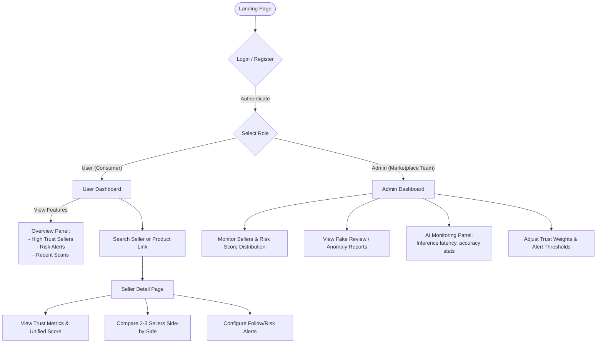

# URTSS - System Diagrams

This document contains visual representations of the **Process Flow / Use-Cases** and the **System Architecture** for the Unified Retailer Trust Scoring System (URTSS).

## 1. Process Flow Diagram / Use-Case Flow

The diagram below outlines the main user flows from the Landing Page to both Consumer (User) and Administrator perspectives.



---

## 2. Architecture Diagram

The system architecture outlines the end-to-end data flow highlighting our local privacy-first AI execution environment, powered by AMD technologies (ONNX Runtime, ROCm, ZenDNN, Ryzen AI).

```mermaid
flowchart TB
    subgraph DataIngestion [1. Data Ingestion Layer]
        direction TB
        Reviews[(Public Seller Reviews & Ratings)]
        Synthetic[(Synthetic MVP Datasets)]
        APIs[(Marketplace Secure APIs)]
    end

    subgraph BackendApp [Backend Application]
        direction TB
        subgraph Pipeline [Trust Pipeline]
            DataPipeline(Data Extractor)
        end

        subgraph AIProcessing [2. AI Processing Layer]
            Sentiment[NLP Sentiment Analysis]
            FakeReview[Fake Review/Rating Detection]
            Behavior[Refund/Support Behavior Analysis]

            Sentiment --- FakeReview --- Behavior
        end

        subgraph TrustLogicEngine [3. Trust Logic Engine]
            LogicCombine{Score Combiner\n(0-100 Trust Score)}
            Explainable[Explainable Score Breakdown Engine]

            LogicCombine --> Explainable
        end
    end

    subgraph InferenceEnvironment [AMD Local Inference Runtime]
        direction LR
        ONNX[ONNX Runtime]
        Quant[INT8 Quantized Models]
        Accel[ROCm GPU / ZenDNN CPU Acceleration]

        ONNX <--> Quant
        Quant <--> Accel
    end

    subgraph Presentation [UI / Presentation Layer]
        direction TB
        WebApp[Web Application / Browser Extension]
        BadgeSystem[Real-Time Trust Badges]
        UserView[Consumer Insights & Risk Alerts]
        AdminView[Admin Monitoring & Analytics]

        WebApp --> BadgeSystem
        WebApp --> UserView
        WebApp --> AdminView
    end

    %% Flow Connections
    DataIngestion --> DataPipeline
    DataPipeline --> AIProcessing

    AIProcessing <-->|Hardware-Accelerated Inference| InferenceEnvironment

    AIProcessing --> LogicCombine
    TrustLogicEngine -->|Unified Trust Scores & Explanations| Presentation

    %% Styling
    classDef amd fill:#000,stroke:#f00,stroke-width:2px,color:#fff
    class ONNX,Quant,Accel amd
```
