```mermaid
flowchart LR

    classDef ingestion fill:#2d2d2d,stroke:#888,color:#fff
    classDef backend   fill:#1a1a2e,stroke:#e8001d,stroke-width:2px,color:#fff
    classDef amd       fill:#e8001d,stroke:#fff,stroke-width:2px,color:#fff
    classDef database  fill:#1a2d40,stroke:#4a9eda,stroke-width:2px,color:#fff
    classDef auth      fill:#2d1a40,stroke:#a855f7,stroke-width:2px,color:#fff
    classDef frontend  fill:#1a2d1a,stroke:#22c55e,stroke-width:2px,color:#fff
    classDef deploy    fill:#2d2010,stroke:#f97316,stroke-width:2px,color:#fff

    subgraph ING["1 - Data Ingestion Layer"]
        direction TB
        R1["Public Reviews and Ratings"]:::ingestion
        R2["Synthetic MVP Datasets"]:::ingestion
        R3["Marketplace Secure APIs"]:::ingestion
    end

    subgraph BE["2 - Backend — FastAPI Python"]
        direction TB
        subgraph API["API Routes"]
            direction TB
            A1["GET /sellers — List, Filter, Search"]:::backend
            A2["GET /sellers/id — Detail, Reviews, History"]:::backend
            A3["POST /sellers/compare — Side-by-Side"]:::backend
            A4["POST /sellers/id/analyze — On-Demand AI"]:::backend
            A5["POST /analyze-text — Live AI Playground"]:::backend
            A6["GET /admin — Admin Controls"]:::backend
        end
        subgraph SVC["Services"]
            direction TB
            S1["trust_engine.py — Orchestrator"]:::backend
            S2["scoring.py — Weighted 0-100 Formula"]:::backend
            S3["review_analysis.py — NLP Preprocessor"]:::backend
        end
        API --> SVC
    end

    subgraph AMD["3 - AMD Local Inference Runtime"]
        direction TB
        TOK["DistilBERT Tokenizer — max_length 128"]:::amd
        subgraph EXEC["Execution Providers"]
            direction LR
            EP1["ROCm GPU<br/>ROCMExecutionProvider"]:::amd
            EP2["CPU Fallback<br/>ZenDNN"]:::amd
        end
        subgraph MDLS["INT8 Quantized ONNX Models"]
            direction LR
            M1["sentiment_model.onnx<br/>Score -1 to +1"]:::amd
            M2["trust_score_model.onnx<br/>Authenticity 0 to 1"]:::amd
        end
        TOK --> EXEC
        EXEC --> MDLS
    end

    subgraph DB["4 - Supabase — PostgreSQL"]
        direction TB
        T1["profiles — Firebase UID, role"]:::database
        T2["sellers — master data, marketplace"]:::database
        T3["trust_scores — 0-100 + 5 sub-scores"]:::database
        T4["seller_metrics — orders, refunds, delivery"]:::database
        T5["reviews — text, sentiment, authenticity"]:::database
        T6["alerts — score_drop, fraud, high_risk"]:::database
        T7["user_watchlist — followed sellers"]:::database
        RLS["Row Level Security — all tables"]:::database
    end

    subgraph AUTH["5 - Authentication"]
        direction TB
        FA["Firebase Auth<br/>Google OAuth and Email"]:::auth
        SR["Supabase RLS<br/>Data Authorization"]:::auth
        RL["Role Guard<br/>user and admin"]:::auth
        FA --> SR --> RL
    end

    subgraph FE["6 - Frontend — React 19 + Vite + TypeScript"]
        direction TB
        P1["Home — Landing Page"]:::frontend
        P2["Seller Details — Trust Score, Reviews, Charts"]:::frontend
        P3["Compare — Side-by-Side View"]:::frontend
        P4["Live AI Playground — Real-time ONNX Demo"]:::frontend
        P5["User Dashboard — Watchlist, Alerts, Profile"]:::frontend
        P6["Admin Panel — Analytics, Batch Analysis"]:::frontend
    end

    subgraph DEP["7 - Deployment"]
        direction TB
        D1["Vercel — Frontend CDN"]:::deploy
        D2["Render — Backend API, Python 3.11"]:::deploy
        D3["Supabase Cloud — Managed PostgreSQL"]:::deploy
    end

    ING  -->|"Data Feed"| BE
    BE   -->|"Inference Request"| AMD
    AMD  -->|"Scores + Results"| BE
    BE   -->|"Read / Write"| DB
    DB   -->|"Data Response"| BE
    AUTH -->|"Session + Roles"| BE
    AUTH -->|"RLS Policies"| DB
    BE   -->|"Trust Scores and API Responses"| FE
    FE   -->|"Direct Queries"| DB
    FE   --- DEP
    BE   --- DEP
    DB   --- DEP
```

---

### Architecture Summary

| Layer          | Technology                                 | Purpose                        |
| -------------- | ------------------------------------------ | ------------------------------ |
| Data Ingestion | Public datasets, Synthetic data, APIs      | Feed seller review data        |
| Backend        | FastAPI, Uvicorn, Python 3.11              | REST API + Trust orchestration |
| AMD AI Runtime | ONNX Runtime, ROCm, ZenDNN, INT8 Models    | Privacy-first local inference  |
| Database       | Supabase PostgreSQL + RLS                  | Persistent data + security     |
| Auth           | Firebase Auth + Supabase RLS               | Login + role-based access      |
| Frontend       | React 19 + Vite + Tailwind + Framer Motion | Consumer + Admin UI            |
| Deployment     | Vercel + Render + Supabase Cloud           | Production hosting             |
