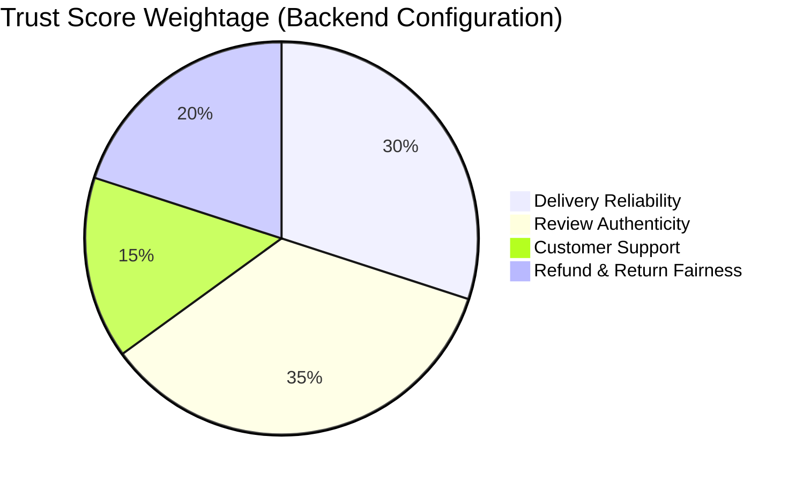

# URTSS - UI Wireframes & Mock Diagrams

This document contains conceptual wireframes and layouts for the Unified Retailer Trust Scoring System (URTSS) using layout diagrams and structural overviews.

## 1. Landing Page Wireframe

The entry point introduces the user to Trustora and allows access to the dashboard.

```mermaid
%%{init: {'theme': 'base', 'themeVariables': { 'primaryColor': '#ffffff', 'edgeLabelBackground':'#ffffff'}}}%%
block-beta
    columns 1
    Header["Logo   |   Home   |   Features   |   Login / Register (Buttons)"]
    Space1[" "]
    HeroContainer<["An Intelligent Layer of Trust for Online Shopping\n\n[ Search Seller or Product Link... ]   [ Analyze ]"]>(1)
    Space2[" "]
    FeaturesContainer{{"Trust Badges | Fake Review Detection | Secure AMD Local AI"}}
    Space3[" "]
    Footer["© 2026 Trustora. Built with AMD."]
```

---

## 2. Consumer (User) Dashboard Wireframe

The dashboard where users see their recently analyzed sellers, risk alerts, and high-trust sellers.

```mermaid
block-beta
    columns 3
    Header["Trustora Logo"] SearchBar["[ Search Seller... ]"] Profile["👤 User Profile"]

    Block1<["🎯 High Trust Sellers\n- TechStore1: 95/100\n- ShoeMart: 91/100"]>(1)
    Block2<["⚠️ Risk Alerts\n- PhoneCaseInc: Alert (Fake Reviews)\n- GadgetHub: Alert (High Returns)"]>(1)
    Block3<["⏱ Recent Scans\n- LaptopWorld: 88/100\n- SneakerCentral: 72/100"]>(1)

    TrendPanel["📊 Your Trust Score Trend Panel (Weekly Overview)"](3)
```

---

## 3. Seller Detail & Trust Metrics Page Wireframe

The detailed view when a user specifically analyzes a single seller, breaking down the trust scores.

```mermaid
block-beta
    columns 2
    HeaderLogo["Trustora Logo"] SearchNav["[ Search... ]   |   👤 Profile"](1)

    SellerInfo<["🏪 Seller: TechStore1\nPlatform: Amazon\nLast Scan: 2 mins ago"]>(1)
    TrustBadge(("Unified Trust Score: 95/100\nBadge: 🟢 HIGH TRUST"))(1)

    BreakdownPanel<["Trust Breakdown\n- Delivery Reliability: 98%\n- Review Authenticity: 93%\n- Customer Support: 90%\n- Refund Fairness: 99%"]>(1)
    ActionPanel<["Actions\n[ Compare with another seller ]\n[➕ Follow ]   [🔔 Set Alert ]"]>(1)

    RiskExplanation["Risk Explanation: No major risks detected. Reviews show high authenticity."] (2)
    HistoricalGraph["📈 Historical Trust Trend Graph (30-day/90-day performance)"] (2)
```

---

## 4. Admin Dashboard Wireframe (Marketplace Operator)

The interface for marketplace administrators or the Trustora internal team to monitor overall network health and AMD AI performance.

```mermaid
block-beta
    columns 4
    HeaderAdmin["Trustora Admin Console"](2) HeaderSpace[" "] ProfileAdmin["👨‍💼 Admin Profile"](1)

    Stat1(("Total Sellers\n15,420"))
    Stat2(("High Risk\n342"))
    Stat3(("Total Reviews Analyzed\n2.4M"))
    Stat4(("AMD Latency\n~15ms / inference"))

    ScoreGraph["📈 Score Distribution Graph"](2)
    AlertLogs["⚠️ Manipulation Detection Logs\n- Spike in 5-star for SellerX\n- High refund rate for SellerY"](2)

    AIPanel["🤖 AI Monitoring Panel\n- NLP Accuracy: 94%\n- Running on ROCm GPU/ZenDNN CPU"](4)
```

---

## 5. Trust Breakdown Visualization (Example)

A mock representation of the individual trust weights using a pie chart.


